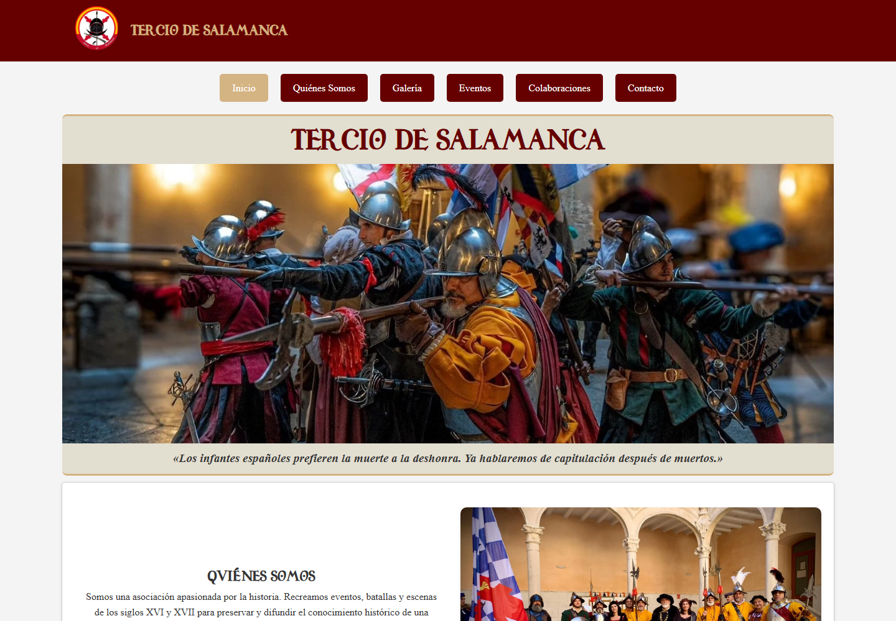
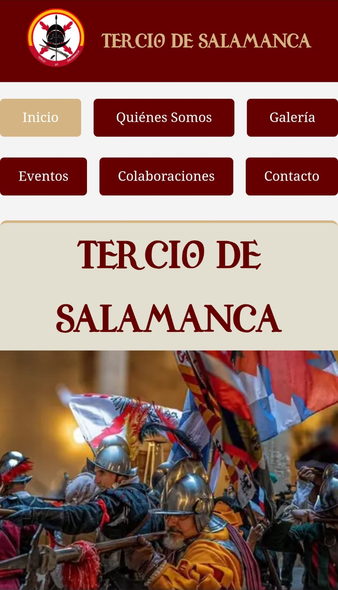

# Tercio de Salamanca — Website Showcase

> **Este repositorio es un showcase de una página web publicada.** Presenta el resultado, sus características y las tecnologías empleadas, pero no contiene el código fuente ni los recursos originales del sitio.

Presentación del sitio web oficial de la **Asociación Cultural Tercio de Salamanca**, una asociación dedicada a la divulgación y recreación histórica de los siglos XVI y XVII.

## Ver la página web

### 🌐 [Visitar terciodesalamanca.es](https://terciodesalamanca.es/)

La web permite conocer la asociación, consultar sus actividades y próximos eventos, recorrer el archivo histórico de participaciones y contactar con el grupo.

## Capturas del proyecto

  

<em>Página de inicio en su versión de escritorio.</em>

  

<em>Página de inicio en un dispositivo móvil.</em>

## Sobre el proyecto

El objetivo del sitio es ofrecer un punto de información claro y accesible para socios, colaboradores y personas interesadas en la recreación histórica. Su diseño visual se inspira en la identidad y el periodo histórico representado por la asociación, manteniendo una navegación sencilla desde cualquier dispositivo.

## Funcionalidades

- Presentación de la asociación y su labor divulgativa.
- Calendario de próximos eventos.
- Actividades permanentes desarrolladas durante el curso.
- Archivo histórico de eventos organizado por años.
- Galería fotográfica enlazada con Flickr.
- Información sobre asociaciones y entidades colaboradoras.
- Formulario de inscripción descargable y vías de contacto.
- Carrusel de contenidos y secciones desplegables.
- Diseño adaptable a ordenadores, tabletas y teléfonos móviles.

## Tecnologías

El proyecto está construido como un sitio web estático, sin frameworks ni dependencias externas de ejecución.

## Trabajo realizado

- Diseño y desarrollo completo de la interfaz.
- Organización de la arquitectura y navegación del sitio.
- Adaptación responsive para diferentes tamaños de pantalla.
- Implementación de interacciones con JavaScript.
- Creación y mantenimiento del archivo histórico de eventos.
- Optimización y publicación en el servidor web.
- Actualización periódica de contenidos y recursos gráficos.

## Estado

Proyecto publicado y en mantenimiento activo. El contenido se actualiza conforme la asociación anuncia nuevas actividades y eventos.

## Acerca de este repositorio

Este es un repositorio de **presentación y portfolio**, no el repositorio de desarrollo de la web. Su finalidad es mostrar públicamente el proyecto terminado mediante una descripción funcional, capturas reales y un enlace a la página en producción.

El código fuente, las fotografías, los documentos, los logotipos y los demás recursos originales se mantienen en un repositorio privado y **no se distribuyen desde aquí**.

© 2026 Asociación Cultural Tercio de Salamanca. Todos los derechos reservados.
